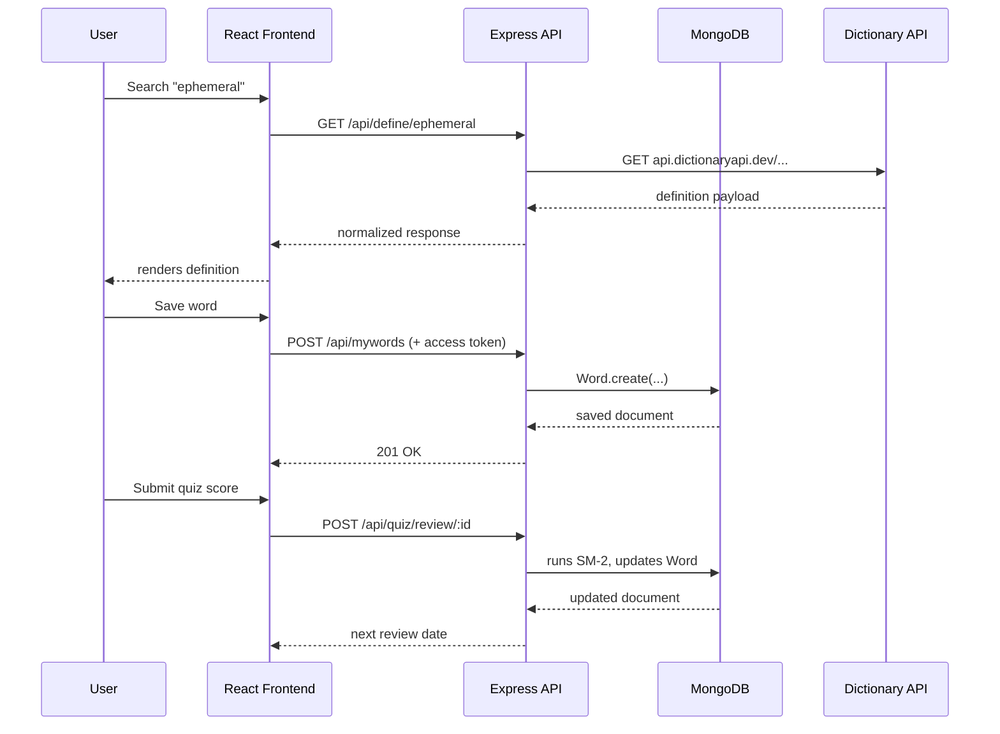
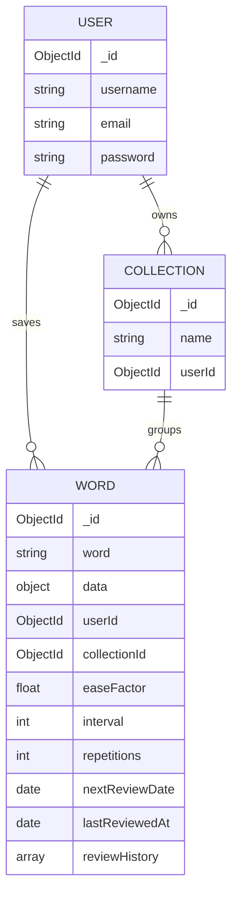

# WordForge

> Search words. Save them. Actually remember them.

Most dictionary apps stop at the lookup. WordForge builds a full learning loop around it — search a word, get its definitions, examples, and synonyms, save it, organize it into collections, and let a spaced repetition scheduler bring it back at the right time.


## Features

**Authentication** — register and login with email/password. Short-lived access tokens (15 min) live in React memory; a long-lived refresh token (7 days) sits in an `httpOnly` cookie. An Axios interceptor silently refreshes on any 401 and retries the original request — no visible re-login prompts.

**Word Search** — definitions, parts of speech, example sentences, synonyms, and antonyms via [Free Dictionary API](https://dictionaryapi.dev/). Gracefully handles API outages with toast notifications rather than broken UI.

**My Words** — your personal saved list, sorted by date added, scoped to your account. Remove words individually. Each entry shows its collection membership at a glance.

**Collections** — named groups for organizing words (e.g. *GRE Prep*, *Technical Terms*). Deleting a collection clears the reference on its words but leaves the words themselves intact.

**Spaced Repetition Quiz** — SM-2 scheduling (the algorithm behind Anki). Each word carries an ease factor, interval, and repetition count. Rate your recall 0–5 after each review: scores ≥ 3 grow the interval, scores < 3 reset it. Up to 20 due words per session. If nothing is due, the app tells you when the next session is.

**Learning Dashboard** — two Recharts visualizations: a daily bar chart (due today vs. reviewed today) on the main dashboard, and a per-word retention line chart (date vs. score, last 10 sessions) accessible from each word's detail view.

---

## Request flow



---

## Data model



`collectionId` lives on the `Word` document rather than as an array inside `Collection`. This keeps collection documents lean regardless of word count, and makes "all words in collection X" a single indexed `Word.find({ collectionId: X })`.

---

## API reference

| Method | Route | Auth | Description |
|--------|-------|------|-------------|
| `POST` | `/api/auth/register` | — | Create account |
| `POST` | `/api/auth/login` | — | Login, sets refresh cookie |
| `POST` | `/api/auth/logout` | — | Clears refresh cookie |
| `POST` | `/api/auth/refresh` | Cookie | Issue new access token |
| `GET` | `/api/define/:word` | ✓ | Fetch definition (proxied) |
| `GET` | `/api/mywords` | ✓ | All saved words |
| `POST` | `/api/mywords` | ✓ | Save a word |
| `DELETE` | `/api/mywords/:id` | ✓ | Remove a word |
| `GET` | `/api/collections` | ✓ | All collections |
| `POST` | `/api/collections` | ✓ | Create a collection |
| `DELETE` | `/api/collections/:id` | ✓ | Delete a collection |
| `POST` | `/api/collections/:id/words/:wordId` | ✓ | Assign word to collection |
| `DELETE` | `/api/collections/:id/words/:wordId` | ✓ | Remove word from collection |
| `GET` | `/api/collections/:id/words` | ✓ | Words in a collection |
| `GET` | `/api/quiz/due` | ✓ | Words due for review (max 20) |
| `POST` | `/api/quiz/review/:wordId` | ✓ | Submit score, runs SM-2 |
| `GET` | `/api/quiz/stats` | ✓ | Due / reviewed / total counts |
| `GET` | `/api/word-of-the-day` | ✓ | Daily word from saved list |
| `GET` | `/api/random` | ✓ | Random word from saved list |

Rate limits via `express-rate-limit`:
- **Auth routes** — 10 req / 15 min
- **Dictionary lookup** — 30 req / min
- **Everything else** — 100 req / 15 min

---

## Running locally

**Prerequisites:** Node.js 18+, MongoDB running locally

```bash
# Clone and install
git clone https://github.com/SharadPandey01/wordforge.git
cd wordforge
npm run install:all

# Configure environment
cp Backend/.env.example Backend/.env
# Fill in MONGO_URI, JWT_SECRET, REFRESH_TOKEN_SECRET

# Start both servers
npm run dev
```

Frontend → `http://localhost:5173`  
Backend → `http://localhost:5000`

---

## Stack

| Layer | Tech |
|-------|------|
| Frontend | React 19, Vite, Tailwind CSS, React Router DOM |
| Charts | Recharts |
| Backend | Node.js, Express, Mongoose |
| Auth | JWT, bcrypt, cookie-parser |
| Rate limiting | express-rate-limit |
| Database | MongoDB |
| Tooling | Concurrently |
